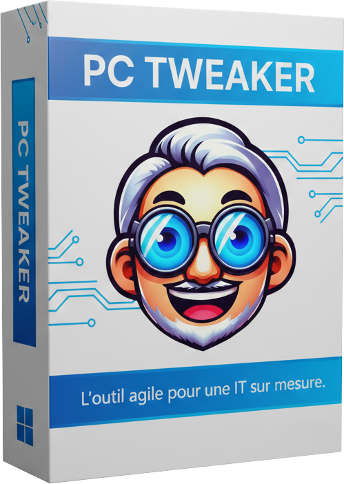

<h1>PC Tweaker</h1>

  

  <em>L'outil agile pour une IT sur mesure.</em>

 
• Destiné aux utilisateurs avancés souhaitant prendre le contrôle de l’environnement Windows, ce logiciel permet de personnaliser, configurer et optimiser le système.
 
Il exploite les outils natifs intégrés à Windows, garantissant un fonctionnement sans surcharge inutile.
 
Pour étendre ses fonctionnalités, il intègre également quelques dépendances open source ou gratuites, sélectionnées pour leur fiabilité.
 
 
• Proposé au format portable, il peut être lancé directement depuis une clé USB ou un dossier local. 
Cette flexibilité le rend idéal pour des interventions rapides sur plusieurs postes utilisateurs ou pour une utilisation nomade.
 
 

 
 
<h1>Obtenir maintenant</h1>
 

 
Version 1.5.0.0 | Publié le : 00.00.2026 | 16.2MB | Compatible avec Windows 11 (x64).
